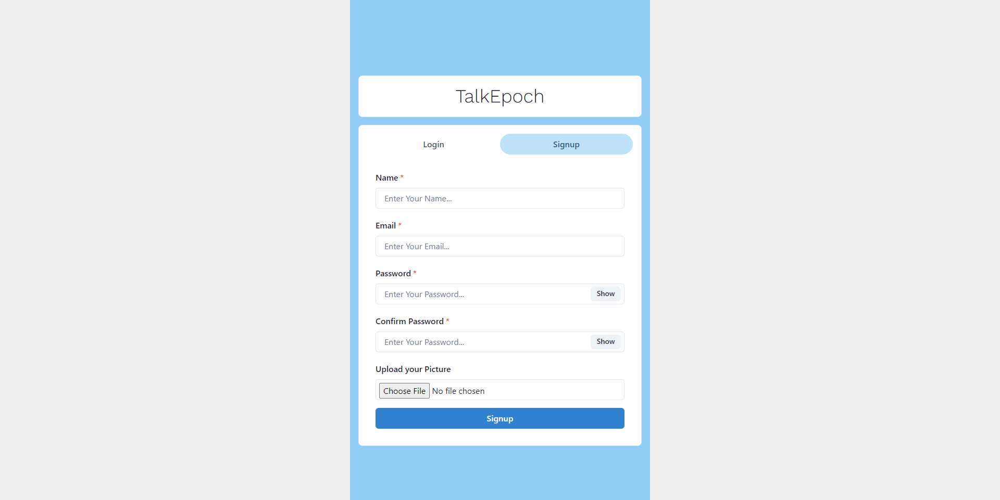
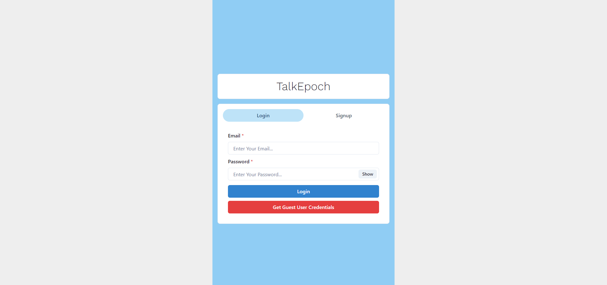
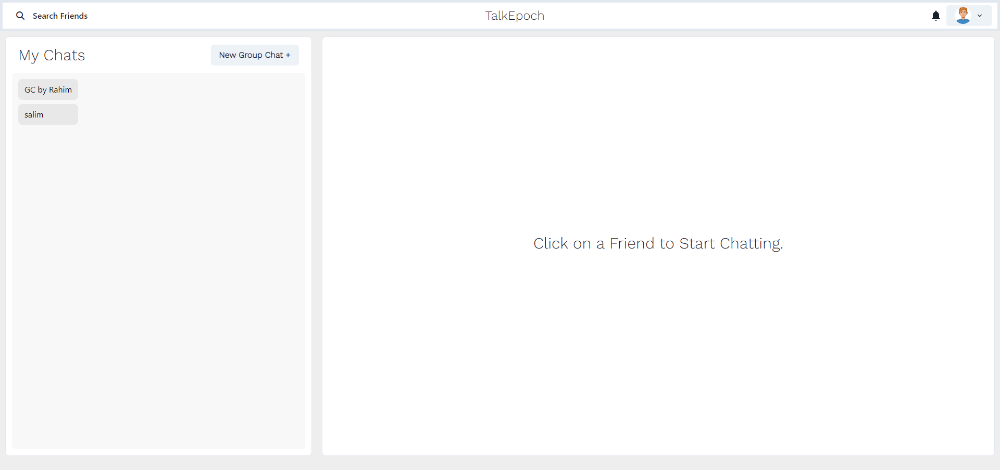
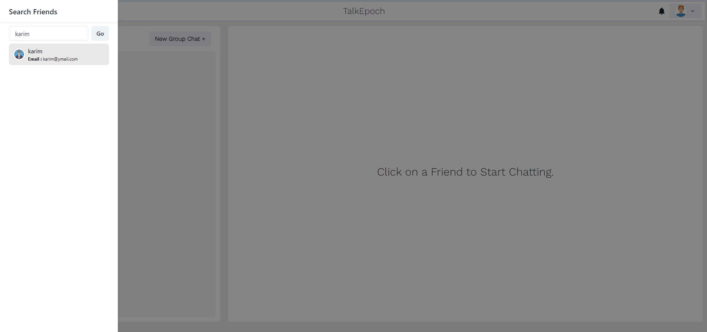
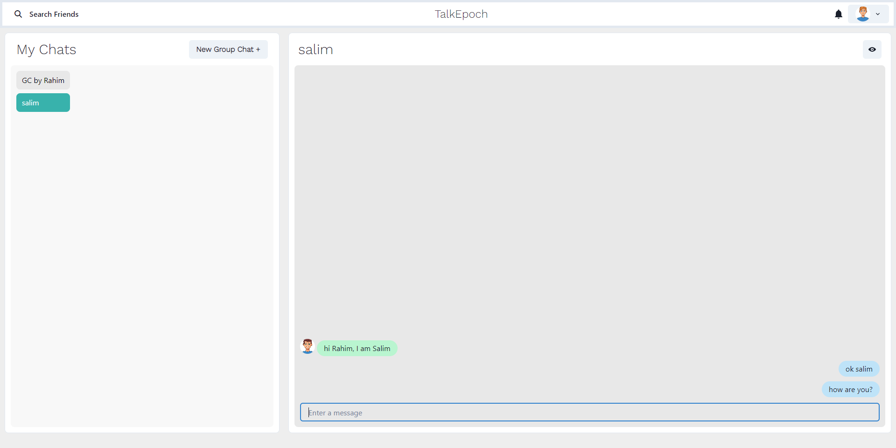
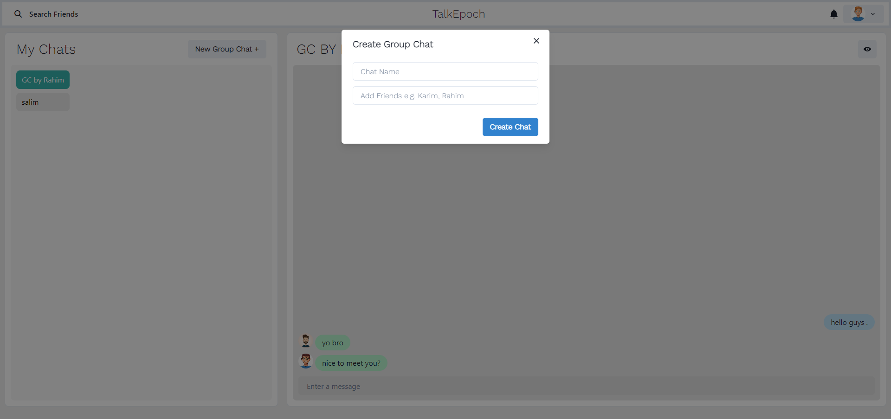
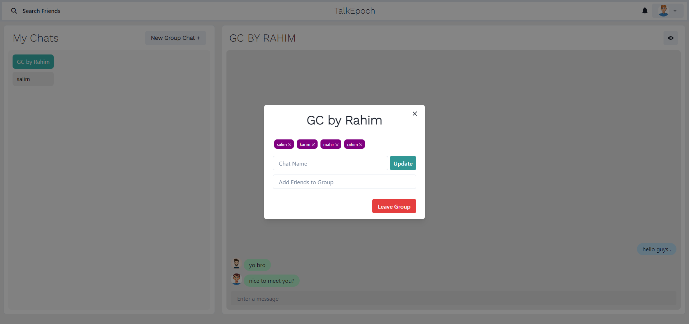
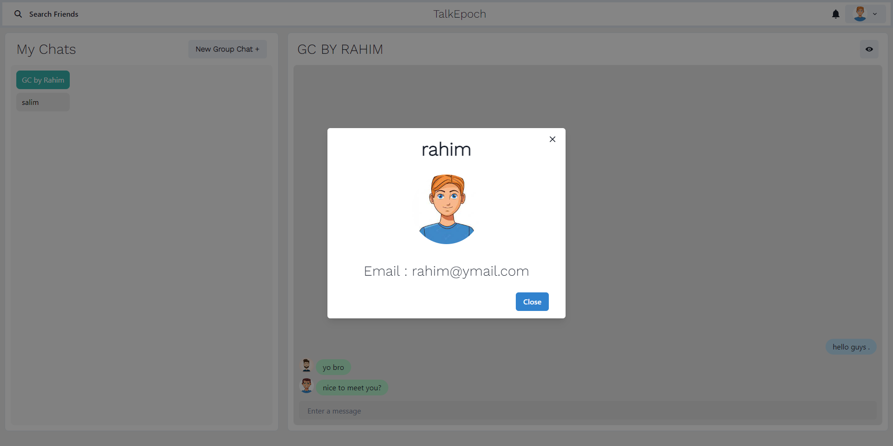

<h2>Chat Application</h2>

It is a chat app built with React Js, Chakra UI, Axios, Node Js, Express Js, Mongodb, Mongoose, Jsonwebtoken, Socket.io

<label>Signup</label>  

   
<label>Login</label>  

   
<label>Home</label>  

   
<label>Search</label>  

   <label>One to One chat</label>  

   <label>Create Group Chat</label>  

   <label>Group Chat</label>  

   
<label>Profile Page</label>  

   
